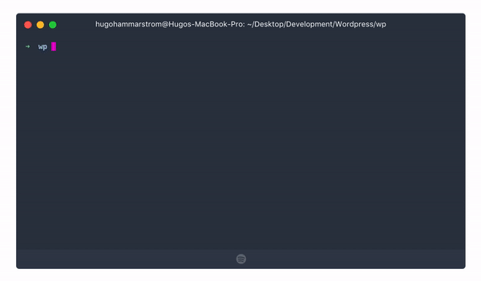

# WP-DPLOY

[](https://badge.fury.io/js/%40hugohammarstrom%2Fwp-dploy) [](https://coveralls.io/github/hugohammarstrom/wp-dploy?branch=master)

Wp-dploy is a cli-tool that simplifies the setup of local wordpress development environments.


### Prerequisites

- [Node](https://nodejs.org/en/) tested with v10.7.0
- [Docker](https://docs.docker.com/install/#supported-platforms)
- [Docker-compose](https://docs.docker.com/compose/install/)

If using `wp-dploy pull`:

- [WP-cli](https://wp-cli.org/) is required on the server

### Getting started

Install wp-dploy globally

```sh
$ npm i -g @hugohammarstrom/wp-dploy
```

Setup project to support wp-dploy:

```sh
$ mkdir new-wp-project
$ cd new-wp-project
$ wp-dploy init
```

Start wp-dploy containers:

```sh
$ wp-dploy start
```

Pull database from server:

```sh
$ wp-dploy pull
```

> **To use the wp-dploy dns you need to add 127.0.0.1 as a namserver in your network configurations, a tip is to add another dns to prevent the network from not working when the wp-dploy dns is stopped. eg: 8.8.8.8 and 8.8.4.4**

### Commands

All commands that wp-dploy supports

#### Init

Init command used to initialize a dploy project

```
$ wp-dploy init
```

Notes:

- If you are not using the wizard to initialize the project you need to replace the placeholders in the .dplorc.json file

#### Start

Start command used to start local invironment

```
$ wp-dploy start | up
```

Notes:

- Must be run in a directory that is initialized as a dploy project

#### Stop

Stop command used to stop local invironment

```
$ wp-dploy stop | down
```

Options:

- -a or --all If you want to stop containers that is not in the current directory

#### Deploy

Stop command used to stop local invironment

```
$ wp-dploy deploy
```

Options:

- -a or --all Deploy to all configured sites
- -t or --tag Deploy a specific commit tag or hash
- -b or --branch The branch to deploy from
- --sites A comma separated string with site names to deploy to

#### List

List all containers that is managed by wp-dploy

```
$ wp-dploy list | ls
```

Notes:

- To use the wp-dploy dns you need to add 127.0.0.1 as a namserver in your network configurations, a tip is to add another dns to prevent the network from not working when the wp-dploy dns is stopped. eg: 8.8.8.8 and 8.8.4.4

#### WP-cli

wp-dploy adds a command to use the internal wp-cli in the docker containers:

```
$ docker-wp
```

Notes:

- This command needs to be executed inside the project directory

### Configuration file

```
{
    "server": {
        "host": "example.com", -- This is the hostname that wp-dploy uses to ssh into the server --
        "username": "root", -- This is the username that wp-dploy uses to ssh into the server --
        "installation": {
            "path": "/home/ubuntu/wp-installation" -- This is the path on the server where wordpress is installed --
        }
    },
    "sites": [{
        "url": "example.com", -- The url to the production website --
        "local_url": "example.localhost" -- The url to the development website locally--
    }]
}
```

### Todos

- Write Tests
- Explore the possibility to use recipes for database pulling. Eg via npm modules
  - Variables in .dployrc.json that can be passed to the recipes
  - Being able to specify which recipe to use in .dployrc.json

## License

MIT © [Hugo Hammarström](https://github.com/hugohammarstrom)

**Free Software, Hell Yeah!**
