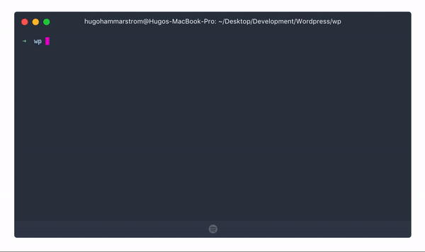

# WP-DPLOY
[](https://badge.fury.io/js/%40hugohammarstrom%2Fwp-dploy)

Wp-dploy is a cli-tool that simplifies the setup of local wordpress development environments. 

##### Prerequisites
  - Node
  - Docker
  - Docker-compose

### Getting started

Install wp-dploy globally

```sh
$ npm i -g @hugohammarstrom/wp-dploy
```

Setup project to support wp-dploy:
```sh
$ wp-dploy init
```

Start wp-dploy containers:
```sh
$ wp-dploy start
```

Pull database from server:
```sh
$ wp-dploy pull
```

**To use the wp-dploy dns you need to add 127.0.0.1 as a namserver in your network configurations, a tip is to add another dns to prevent the network from not working when the wp-dploy dns is stopped. eg: 8.8.8.8 and 8.8.4.4**


### Configuration file
```
{
    "server": {
        "host": "example.com", -- This is the hostname that wp-dploy uses to ssh into the server --
        "username": "root", -- This is the username that wp-dploy uses to ssh into the server --
        "installation": {
            "path": "/home/ubuntu/wp-installation" -- This is the path on the server where wordpress is installed --
        }
    },
    "sites": [{
        "url": "example.com", -- The url to the production website --
        "local_url": "example.localhost" -- The url to the development website locally--
    }]
}
```

### Todos

 - Write Tests

License
----

MIT


**Free Software, Hell Yeah!**
